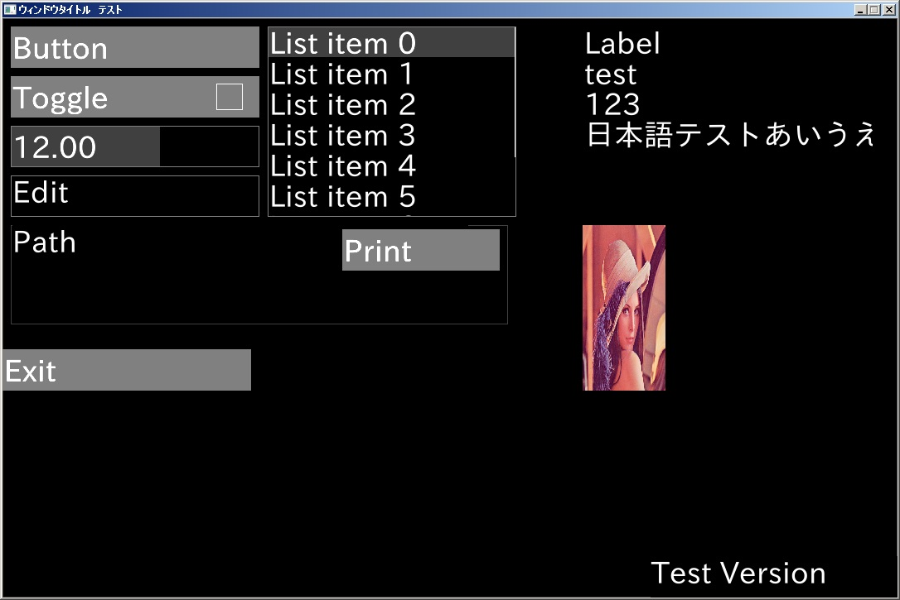

WidgetSDL2
====

# Overview
WidgetSDL2 - C99/SDL2によるクロスプラットホームなシンプルGUI
(2016.12.02)

# Description
C99によるクロスプラットホームに対応したシンプルGUI  
クロスプラットホームに対応したGUIは探すのは難しくない  
例えば、wxWidgets、Qt、Tcl/tk、言語を問わなければJAVA、C#など星の数ほどある  
しかしながらAndroid(Root取得なし)でGUIが作成できるツールは、探したがほとんど見つからなかった  
今回プログラムは、Androidでちょっとしたツールに使用できるGUIをコンセプトに作成した  

# Domo
サンプル(gui_test)  
```c:main.c
#include "SDL2/SDL.h"
#include "../../include/guiglobal.h"
bool Run(void) {
    printf("Hello World!, 日本語テスト\n");
    return(true);
}
```
サンプル(widget_test)  


# Requirement
OS  
Windows or Linux or Android  
GCC 5.1 or Visual Stduio 2015 or C4droid  
SDL2  

テスト環境
Windows7(32bit)  
Android(C4droid)  
Raspberry Pi3  

# Usage
only include header

# Install
only include header

# License
MIT

# Author
nuchida7727@gmail.com

#Reference
ke2k-tools  
https://gitorious.org/ke2k-toolkit/ke2k-toolkit  

